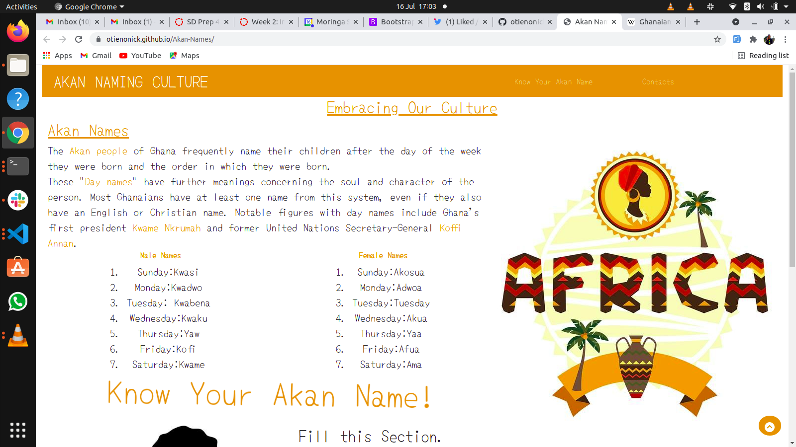
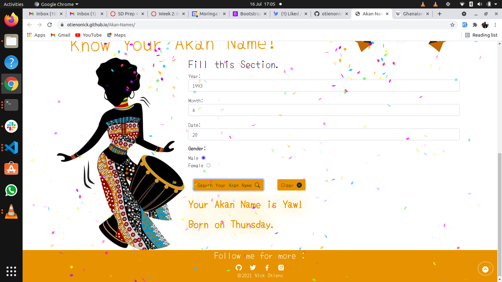

## MY PORTFOLIO.
# PROJECT DEVELOPER;
* Nick Otieno

# Project Description
## A website that shows a user his or her Akan name on filling a form , a naming system of a certain tribe of the Ghananian race.

| MALES| FEMALES | 
| ---  | ----| 
| 1.Sunday : Kwasi| 1.Sunday : Akosua|  
| 2.Moday : Kwadwo|  2.Monday : Adwoa  |
| 3.Tuesday : Kwabena| 3.Tuesday : Abena  |
| 4.Wednesday : Kwaku| 4.Wednesday : Akua|
| 5.Thursday : Yaw| 5.Thursday : Yaa|
| 6.Friday : Kofi| 6.Friday : Afua|
| 7.Saturday : Kwame| 7.Saturday : Ama|

## The website has;
* Images
* Links
# Technologies Used;
* HTML
* JAVASCRIPT
* CSS
* BOOTSTRAP

## live site link : https://otienonick.github.io/Akan-Names/
# LICENCE

## Contacs: 

    
        

##   : 0718849600

## &copy;2021 Nick Otieno.

